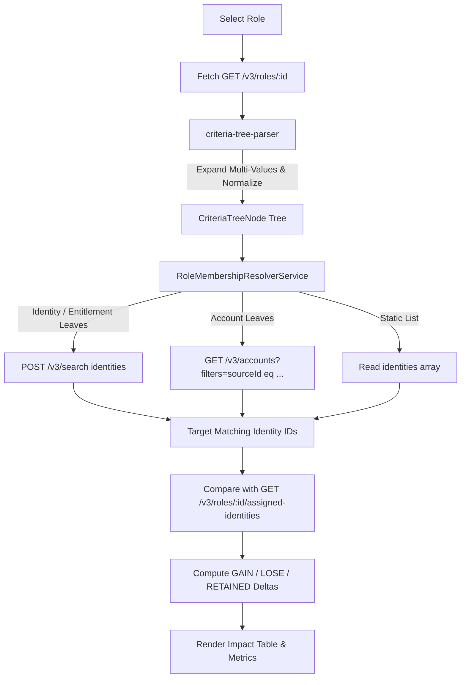

# SailPoint UI Plugins — Role Refresher & "Apply Changes" Simulator

An Identity Security Cloud (ISC) UI Plugin that simulates role membership changes and evaluates assignment criteria against connected accounts, entitlements, and identities before changes are applied.

---

## 🎯 Problem Statement

When an administrator updates assignment criteria on a Role in SailPoint Identity Security Cloud (ISC), clicking the native **"Apply Changes"** button triggers global identity processing across the entire tenant without a preview or dry run. 

A single typographical error or misconfigured criteria group can inadvertently:
- **Mass Deprovision**: Prematurely revoke critical access and entitlements from authorized users.
- **Overprovision**: Grant sensitive access profiles or entitlements to unauthorized populations.
- **Tenant Overhead**: Trigger computationally expensive global recalculations across tens of thousands of identities.

---

## 💡 Solution & Key Features

The **Role Refresher & Apply Changes Simulator** plugin gives administrators complete visibility and surgical control before committing access changes:

1. **Interactive Role Inspector**:
   - Browse and select any tenant role.
   - Live synchronization: Direct `GET /v3/roles/:id` inspection ensures newly saved criteria in ISC are immediately evaluated without stale cache delays.

2. **Advanced Criteria Resolution Engine**:
   - **Full Boolean Tree Normalization**: Recursively evaluates nested `AND`/`OR` criteria groups up to the ISC schema limit.
   - **Multi-Value Criteria Support**: Properly parses and expands multi-value leaf conditions (e.g., `Location EQUALS ("Singapore" OR "London")`).
   - **ISC Search API Integration**: Translates Identity and Entitlement criteria into optimized Elasticsearch query strings (`POST /v3/search`) executed against the `identities` index.
   - **Nested Entitlement Matching**: Uses `@access(type:ENTITLEMENT AND source.id:... AND ...)` to accurately match entitlement criteria across connected systems.
   - **Account Attribute Evaluation**: Reconciles non-searchable custom account attributes by querying `/v3/accounts` scoped to the target source and evaluating attributes client-side.
   - **Static Membership Support**: Audits `IDENTITY_LIST` membership against assigned users.

3. **Delta Calculation & Impact Audit**:
   - **+ Will Gain Role**: Identifies identities meeting assignment criteria who do not yet have the role assigned.
   - **- Will Lose Role**: Flags identities who currently have the role but will lose it under the new criteria (**Deprovisioning Risk Audit**).
   - **= Retained Members**: Confirms identities whose membership remains intact.
   - **Net Role Delta**: Summarizes total population change.

4. **Targeted Identity Processing Execution**:
   - Dispatches identity recalculation jobs via `POST /identities/v1/process` targeting *only* selected or impacted identities (`ALL_IMPACTED` or individual users).
   - Bypasses the need for global tenant-wide "Apply Changes" refreshes.

5. **Enterprise UI (SailPoint Design System)**:
   - Modern, executive interface built with Angular 21 and PrimeNG 21 styled using SailPoint Design System tokens (`--spds-*`).
   - Clean, accessible SVG iconography and structured typographic status tags (`MATCH` / `MISMATCH`) with zero raw emojis.

---

## 🏗️ Architecture & Component Overview

```
role-refresher-tyler/src/app/
├── app.html / app.scss                   # Shell navigation & brand bar (SVG icons, SPDS layout)
├── core/
│   ├── sailpoint-plugin.service.ts       # COIP postMessage handshake & scoped bearer token relay
│   └── spds-prime-theme.ts               # SailPoint Design System PrimeNG theme preset
└── features/role-refresher/
    ├── criteria-tree-parser.ts           # Recursive parser normalizing criteria trees & multi-value leaves
    ├── leaf-resolver.ts                  # Elasticsearch & accounts filter query generator
    ├── role-membership-resolver.service.ts # Search & Accounts orchestration service
    ├── role-membership.types.ts          # Type definitions mirroring ISC Role membership schema
    ├── role-refresher.component.ts       # Main controller: role diff evaluation & targeted processing
    ├── role-refresher.component.html     # KPI metrics, criteria inspector, and interactive diff table
    └── role-refresher.component.scss     # Styled component layout conforming to SPDS
```

### Criteria Resolution Flow



---

## 🚀 Development & Usage

### Prerequisites
- **Node.js**: `v24.21+` (or latest LTS)
- **npm**: `v11.19+`
- **SailPoint CLI**: `v2.7.0+` (`sail`)

### Installation & Local Development

1. Navigate to the plugin directory and install dependencies:
   ```bash
   cd role-refresher-tyler
   npm install
   ```

2. Start the local SSL development server:
   ```bash
   npm start
   ```
   *The dev server runs over HTTPS at `https://localhost:4200/` as required for iframe embedding in ISC.*

3. Link the local plugin to your active tenant session:
   ```bash
   sail ui-plugins link
   ```
   Open your tenant and append `?spPluginDev=role-refresher-tyler` to view the live local bundle inside the ISC shell.

### Production Build & Tenant Upload

1. Compile the production bundle:
   ```bash
   npm run build
   ```

2. Deploy the compiled assets directly to the ISC CDN:
   ```bash
   sail ui-plugins upload
   ```

3. Access the deployed plugin in the tenant:
   ```text
   https://<tenant>.identitynow-demo.com/ui/plugin/<plugin-instance-id>
   ```
   *(Optionally add the plugin to the ISC navigation bar via **Admin → Global → System Settings → Customize Navbar**).*

---

## 🔒 Security & Git Hygiene

- Sensitive credentials, tenant client secrets, and authentication keys (`creds.json`) are permanently ignored in `.gitignore` and must never be committed.
- Build artifacts (`dist/`), Angular cache (`.angular/`), and CLI search output directories are excluded from version control.
